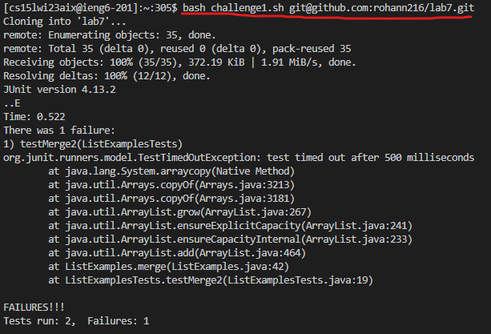
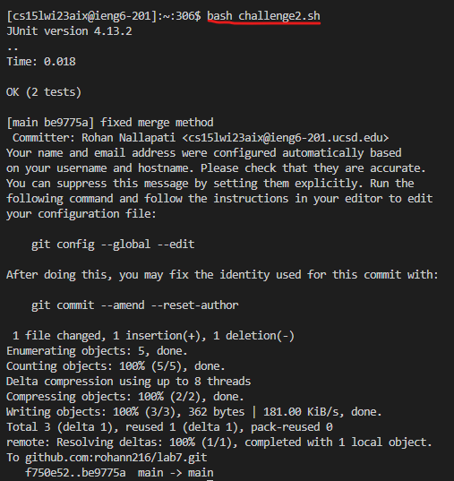

# How to automate a task with a bash script (lab 6)

## Challenge Tasks (same as week 7 report)
- Setup Delete any existing forks of the repository you have on your account
- Setup Fork the repository (Repo to fork: [lab7](https://github.com/ucsd-cse15l-w23/lab7))
- The real deal Start the timer!
- Log into ieng6
- Clone your fork of the repository from your Github account
- Run the tests, demonstrating that they fail
- Edit the code file to fix the failing test
- Run the tests, demonstrating that they now succeed
- Commit and push the resulting change to your Github account

## Step 1-3 (setup)
- start by setting everything up
    - fork the repo if haven't already
    - open up your terminal and get ready 

## Creating the bash script
### First Script
```bash
# Step 1: clone the forked repo
git clone $1
cd lab7
# Step 2: Run the tests to demonstrate failure 
javac -cp .:lib/hamcrest-core-1.3.jar:lib/junit-4.13.2.jar *.java
java -cp .:lib/hamcrest-core-1.3.jar:lib/junit-4.13.2.jar org.junit.runner.JUnitCore ListExamplesTests
# Step 3: Use nano command to start editing faulty code
nano ListExamples.java
```
### Explanation
- This script will first clone the forked repo in the remote server
- It then runs the tests to demonstrate failure and nanos into the buggy java file

### Second Script
```bash
# Step 4 (after making changes to file) rerun tests to show success
cd lab7
javac -cp .:lib/hamcrest-core-1.3.jar:lib/junit-4.13.2.jar *.java
java -cp .:lib/hamcrest-core-1.3.jar:lib/junit-4.13.2.jar org.junit.runner.JUnitCore ListExamplesTests

# Step 5 upload changes to remote repo
git add *.java
git commit -m "fixed merge method"
git push
cd ~
rm -rf lab7
```

### Explanation
- This script cds into lab7 dir after java file has been fixed
- It will show success, and we can then upload the file to the remote repo

## Putting Everything Together
- We must scp the two scripts into the home directory on the ieng6 server
- Then we need to ssh into the remote server to get ready for using scripts
- The next step is to run the first script, which will open up the nano file
- Make edits to the file the same way as week 7 lab
- Can then run the second script to complete the challenge\
- Notice that the only thing we didn't improve from the week 7 method is editing the file
- We had to do two extra steps: Scp the scripts (only needs to be done once), and ssh into the server (also only done once)
- Also notice we recursively remove the cloned fork so you can do the setup much easier to try the challenge again

## Screenshots of Commands and Results
### First script

### Second script

- After these two commands, the challenge is complete
- Should take less than 10 seconds if done quickly

<p style="text-align: center; font-style: italic;">Thank you for reading, hope you've gained new knowledge on the usefulness of scripts!</p>