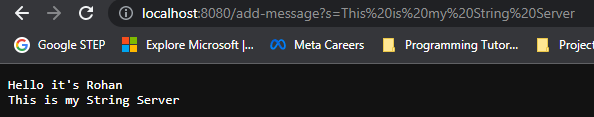
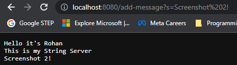
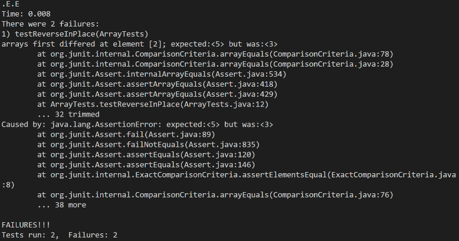

# Part 1: String Server
## String Server Code
```java
import java.io.IOException;
import java.net.URI;

class Handler implements URLHandler {
    String str = "";

    public String handleRequest(URI url) {
        if (url.getPath().contains("/add-message")) {
            if (url.getQuery() == null)
                throw new NullPointerException("Requires Query");
            String[] param = url.getQuery().split("=");
            if (param[0].equals("s")) {
                str += param[1] + "\n";
                return str;
            }
        }
        return "404 Not Found!";
    }
}

class StringServer {
    public static void main(String[] args) throws IOException {
        if(args.length == 0){
            System.out.println("Missing port number! Try any number between 1024 to 49151");
            return;
        }

        int port = Integer.parseInt(args[0]);

        Server.start(port, new Handler());
    }
}
```
## Code Explanation 
- Start by creating a class that implements `URLHandler` interface 
    - This interface was created in a different file and contains a method called `handleRequest` that takes in a url of reference type `URI`
- To implement the `handleRequest` method, we just need to handle the path `/add-message`, and return a 404 error if file path is anything else
- The if statement contains a String array takes the query and splits it around the equals sign, `param[0]` must be s and `param[1]` is the message
    - if no query, output will be a message saying Requires Query(null pointer exception)
    - if `param[0]` is not s then it will return 404 message
- `str` variable is concatenated by whatever the message is and a new line each query request, and returned
- The main method requests a port number in the command line and starts server with `Server.start` (implementation not shown)

## Server Screenshots (w/ explanation)
### Screenshot 1 (msg = This is my String Server)

- As you can see in the URL, the message after the = is "This is my String Server"
    - URL in Chrome browser doesn't allow spaces so it automatically converts them to `"%20"`
- The `handleRequest` will be called with argument `http://localhost:8080/add-message?s=This%20is%20my%20String%20Server`
    - This method is called through the main method which starts server with whatever port is inputted at command line and `new Handler()`
    - The `new Handler()` is where the handleRequest method lies and where `str` is first initialized to empty string
- After the `handleRequest` method checks the path for `add/message`, it will see that the `param` String array will be initialized through a get query request, making it `{"s", "This is my String Server"}`
- `str` will then be concatenated by `"This is my String Server \n"` and return it on the screen 
    - Notice `str` was already `"Hello it's Rohan \n"` before this request, meaning there was path inputted in the URL bar before this with that message in the query
### Screenshot 2(msg = Screenshot 2!)

- The same process will be followed for this request, but the URL argument will be `http://localhost:8080/add-message?s=Screenshot%202!`
    - New query message that concatenates `str` is `"Screenshot 2! \n"`, as can be seen by what has been outputted on the page

# Part 2: Debugging
## Failure and Non-Failure Incuding Inputs (via JUnit tests)
```java 
	@Test 
	public void testReverseInPlace() {
    int[] input1 = { 3 };
    int[] input2 = {5, 4, 3};
    ArrayExamples.reverseInPlace(input1);
    ArrayExamples.reverseInPlace(input2);
    assertArrayEquals(new int[]{ 3 }, input1);
    assertArrayEquals(new int[]{3, 4, 5}, input2);
	}


  @Test
  public void testReversed() {
    int[] input1 = { }; 
    int[] input2 = {1, 2, 3};
    assertArrayEquals(new int[]{ }, ArrayExamples.reversed(input1));
    assertArrayEquals(new int[]{3, 2, 1}, ArrayExamples.reversed(input2));
  }
```
### Analysis 
- `input 1` in both tests are non failure inducing as the bugged programs 
output the correct results (expected)
    - { 3 } &rarr; { 3 } (reversed correctly)
    - { } &rarr; { } (reversed correctly)
- `input 2` in both tests are failure inducig as the bugged programs output the wrong results (unexpected)
    - {5, 4, 3} &rarr; {3, 4, 3} (incorrect... expect: {3, 4, 5})
    - {1, 2, 3} &rarr; {0, 0, 0} (incorrect... expect: {3, 2, 1})

## Symptom of the bug (terminal error output)


## Before and After Debugging
### Before
```java
  static void reverseInPlace(int[] arr) {
    for(int i = 0; i < arr.length; i += 1) {
      arr[i] = arr[arr.length - i - 1];
    }
  }

  static int[] reversed(int[] arr) {
    int[] newArray = new int[arr.length];
    for(int i = 0; i < arr.length; i += 1) {
      arr[i] = newArray[arr.length - i - 1];
    }
    return arr;
  }
```
### After
```java
  static void reverseInPlace(int[] arr) {
    int [] copyArr = new int[arr.length];
    for (int i = 0; i < arr.length; i++) {
      copyArr[i] = arr[i];
    }
    for(int i = 0; i < arr.length; i += 1) {
      arr[i] = copyArr[arr.length - i - 1];
    }
  }

  static int[] reversed(int[] arr) {
    int[] newArray = new int[arr.length];
    for(int i = 0; i < arr.length; i += 1) {
      newArray[i] = arr[arr.length - i - 1];
    }
    return newArray;
  }
```
## Debug Explanation
- In `reverseInPlace`, the bugged code receives an int array `arr` and tries to switch the order with a for loop 
    - The problem with this approach is that the pointers to the original array don't exist because you are changing it as you go
    - The fix is to create a copy array `copyArr` that can be pointed to correctly as it doesn't change while arr is being reversed
- In `reversed`, the bugged code receives an int array `arr` and tries to create a new array `newArr` in order to return a reversed int array
    - The problem with this program is that it replaces `arr` with the reversed values of `newArr` in order, but `newArr` is an empty array
    - A possible fix as shown above is to set the reversed `arr` values to the empty `newArr` in order, which can then be returned as a reversed array

# Part 3 - What I Learned 
This lab helped me better understand how JUnit works, as well as how to set up a server. I also got to practice valuable debugging skills. What I feel was most important for me was that I got to practice more with java, command line, and file structure, as I feel I will be using these a lot in the future. Something I didn't know before was how the HttpHandler interface works. While I am still a bit lost on how to implement it, I know it exists and how it can be used. 