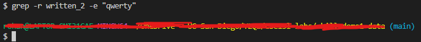
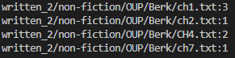
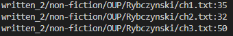
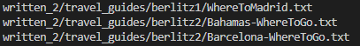
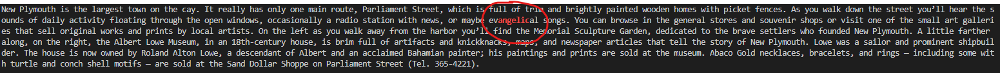

# Ways to use the `grep` command

## What is `grep`
- `grep` is a command that allows you to searh files for certain patterns
- If you ever needed to see an output of lines from a file containinig some string, `grep` is the command you want to use
- `grep <<string>> <<files>>` is a common use of the command, so I will give four other ways of using `grep`

## Command 1: `grep -r <<directory>> -e <<string>>`
[Source](https://www.cyberciti.biz/faq/howto-use-grep-command-in-linux-unix/)
### Example 1
- Input: `grep -r written_2 -e "angelic"` 
- Output: 

### Explanation
-  This command recursively searched the `written_2` for text files and printed a section of the them that contain the string "angelic" 

### Example 2
- Input: `grep -r written_2 -e "qwerty"`
- Output: 

### Explanation
- This time, the command showed no output because there was no string "qwerty" that exists in any txt files contained in the `written_2` path recursively

## Command 2: `grep -rc <<string>> <<directory>>`
[Source](https://www.cyberciti.biz/faq/howto-use-grep-command-in-linux-unix/)
### Example 1
- Input: `grep -rc "however" written_2/non-fiction/OUP/Berk`
- Output: 

### Explanation
-  Building off from the previous command, grep -rc allows us to search directories recursively but now count how many times the string appears rather than output the lines it appears in

### Example 2
- Input: `grep -rc "the" written_2/non-fiction/OUP/Rybczynski`
- Output: 

### Explanation
- We can see that the string "the" appears 35, 32, and 50 times respectively in the three txt files contained in the `written_2/non-fiction/OUP/Rybczynski` directory

## Command 3: `grep -rl <<string>> <<directory>>`
[Source](https://www.cyberciti.biz/faq/howto-use-grep-command-in-linux-unix/)
### Example 1
- Input: `grep -rl "angelic" written_2`
- Output: 

### Explanation
-  We can see that the -l switch allows us to see only the files that contain the matched string, in this case it is these three txt files in berlitz1 and berlitz2

### Example 2
- Input: `grep -rl "monster" written_2`
- Output: 

### Explanation
- We see that many txt files contain monster, appearing even in the `non-fiction` subdirectory 

## Command 4: `grep --color <<string>> <<file>>`
[Source](https://www.cyberciti.biz/faq/howto-use-grep-command-in-linux-unix/)
### Example 1
- Input: `grep --color angelic written_2/travel_guides/berlitz2/Bahamas-WhereToGo.txt`
- Output: 

### Explanation
-  The --color option allows us to highlight the string appearances in whatever lines containing that string are outputted
- You may recognize that this is the same file and string we saw in the 1st command section, though this time it is far easier to locate where "angelic" can be found in the block of text that is outputted  

### Example 2
- Input: `grep --color Ice  written_2/travel_guides/berlitz2/Canada-WhereToGo.txt`
- Output: 

### Explanation
- This time, we can see that --color is useful to spot multiple appearances as well

Thank you for reading, hope you have learned more about the <b>grep</b> command!

