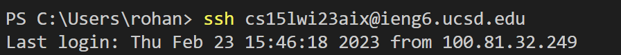
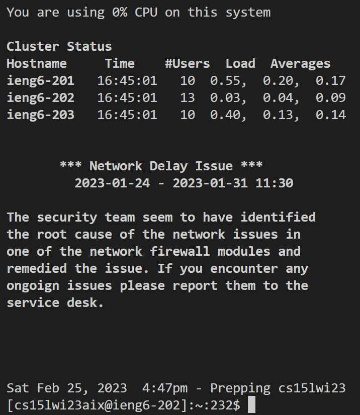
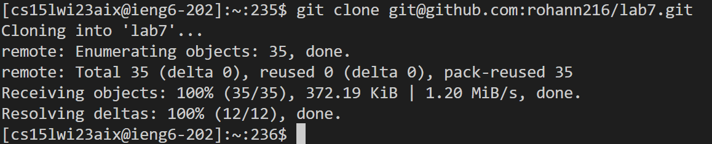
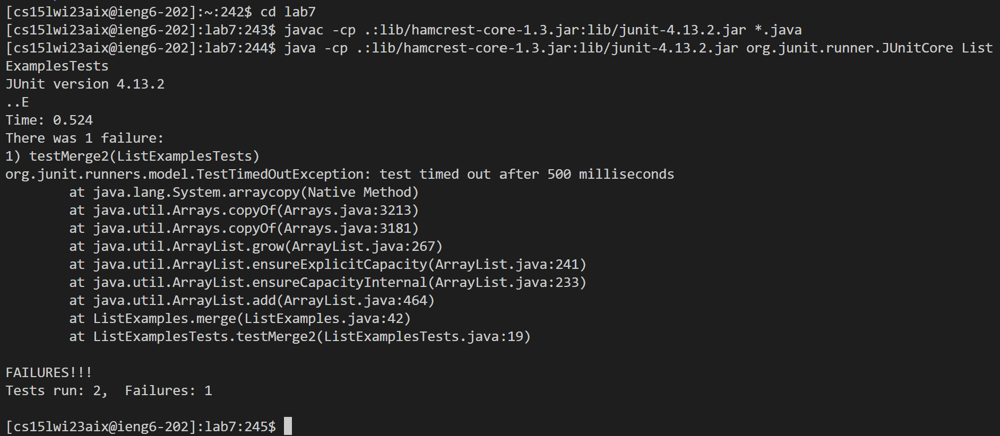
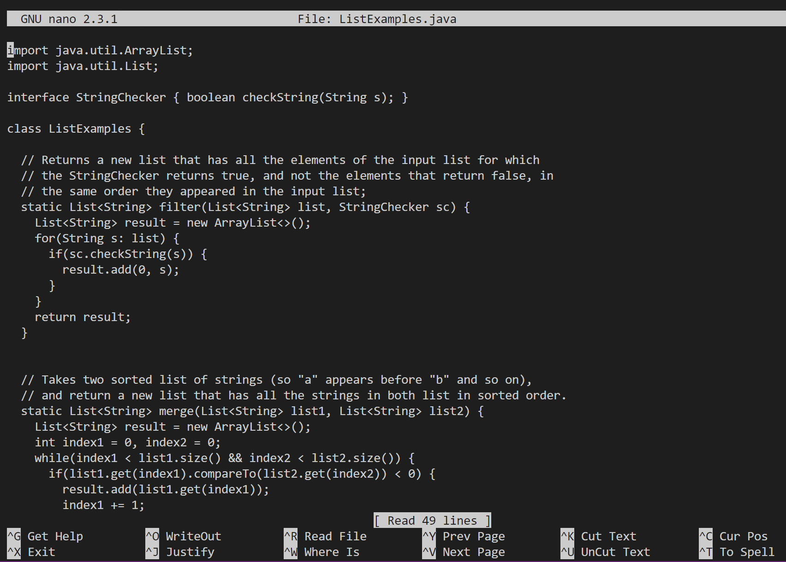
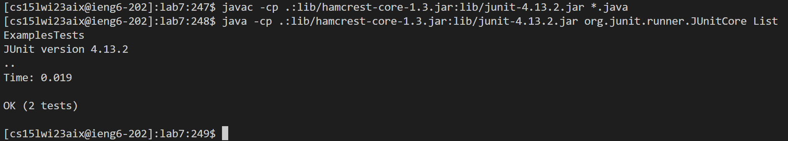
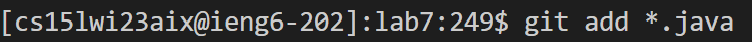
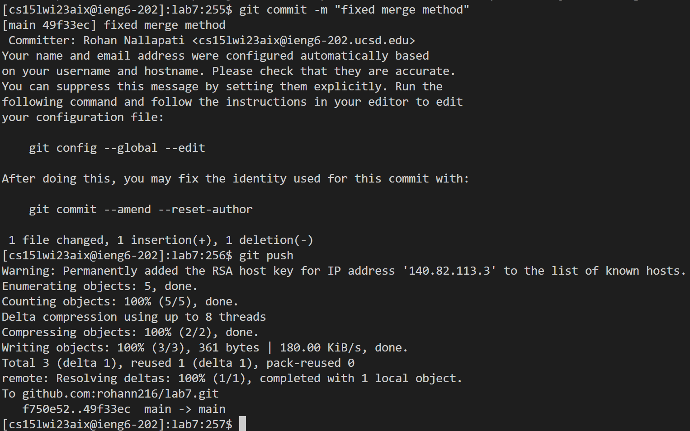

# How to use the terminal more efficiently 

## Challenge tasks (Repo to fork: [lab7](https://github.com/ucsd-cse15l-w23/lab7)) 
- Setup Delete any existing forks of the repository you have on your account
- Setup Fork the repository
- The real deal Start the timer!
- Log into ieng6
- Clone your fork of the repository from your Github account
- Run the tests, demonstrating that they fail
- Edit the code file to fix the failing test
- Run the tests, demonstrating that they now succeed
- Commit and push the resulting change to your Github account

## Step 1-3 (setup)
- start by setting everything up
    - fork the repo if haven't already
    - open up your terminal and get ready 

## Step 4 (Log into ieng6)
### Command: ssh cs15lwi23aix@ieng6.ucsd.edu
### Keys pressed: `<ctrl>-R` `S` `<enter>`
### Screenshots:

### Explanation
- I have already typed the ssh command before so I can just check my cmd history using `<ctrl>-R` and type the first letter + `<enter>` to run the command
- The ssh cmd didn't prompt a password because I set up an SSH key for the remote server

## Step 5 (clone the repo)
### Command: git clone git@github.com:[user]/lab7.git
### Keys pressed: `<ctrl>-R` `G` `<enter>`
### Screenshot: 

### Explanation
- Like the last command, I have previously typed it, so I can use `<ctrl>-R` to open up history and type the first letter and hit `<enter>` to run the command
- Notice that I use the SSH key to clone, which is better because I won't need to input a password and email for github when I push changes later

## Step 6 (run the tests to show failure)
### Commands: `cd lab7` &rarr; `javac -cp .:lib/hamcrest-core-1.3.jar:lib/junit-4.13.2.jar *.java` &rarr; `java -cp .:lib/hamcrest-core-1.3.jar:lib/junit-4.13.2.jar org.junit.runner.JUnitCore ListExamplesTests`
### Keys pressed: `<ctrl>-R` `C` `D` `<space>` `L` `<enter>` `<ctrl>-R` `J` `A` `V` `A` `C` `<enter>` `<ctrl>-R` `J` `A` `V` `A` `<space>` `<enter>` 
### Screenshot: 

### Explanation
- We now have to do these 3 commands, so `<ctrl>-R` will be used 3 times
- More letters must be inputted after `<ctrl>-R` because of similar commands

## Step 7 (fix the buggy file)
### Command: `nano ListExamples.java`
### Keys pressed: `<ctrl>-R` `N` `A` `<enter>` (hold until reach buggy line)`<down>` (hold until reach buggy character)`<right>` `<ctrl>-D` `2` `<ctrl>-O` `<enter>` `<ctrl>-X`
### Screenshot(after nano command): 

### Explanation
- This is the most time consuming step because you have to hold the down arrow and right arrow until reaching the spot you need to fix
- Other than that there are just a few keys/cmds to click that will save the changes you made

## Step 8 (Run the tests to show success)
### Command: `javac -cp .:lib/hamcrest-core-1.3.jar:lib/junit-4.13.2.jar *.java` &rarr; `java -cp .:lib/hamcrest-core-1.3.jar:lib/junit-4.13.2.jar org.junit.runner.JUnitCore ListExamplesTests`
### Keys pressed: `<ctrl>-R` `J` `A` `V` `A` `C` `<enter>` `<ctrl>-R` `J` `A` `V` `A` `<space>` `<enter>` 
### Screenshot: 

### Explanation
- The commands and keys pressed are the same as step 6, this time without having to `cd` into anything

## Step 9 (Commit and push changes to Github)
### Commands: `git add *.java` &rarr; `git commit -m "fixed merge method` &rarr; `git push`
### Keys pressed: `<ctrl>-R` `G` `I` `T` `<space>` `A` `<enter>` `<ctrl>-R` `G` `I` `T` `<space>` `C` `O` `<enter>` `<ctrl>-R` `G` `I` `T` `<space>` `P` `<enter>`
### Screenshot: 

### Explanation
- For this step, just have to input three commands, each of which will require you to type out `git` and `<space>`
- Typing the next letter for each command will allow you to press `<enter>` to autocomplete, except for `git commit` which requires an extra letter(otherwise you would autocomplete `git clone`)
- And that's it! Changes should be pussed to remote.

Thank you for reading, hope this has made you more efficient at using the terminal
